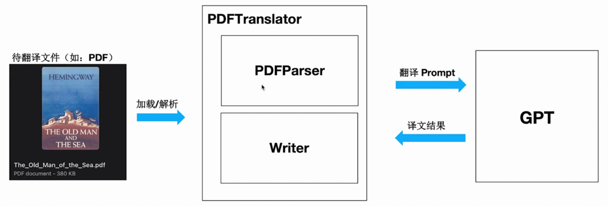
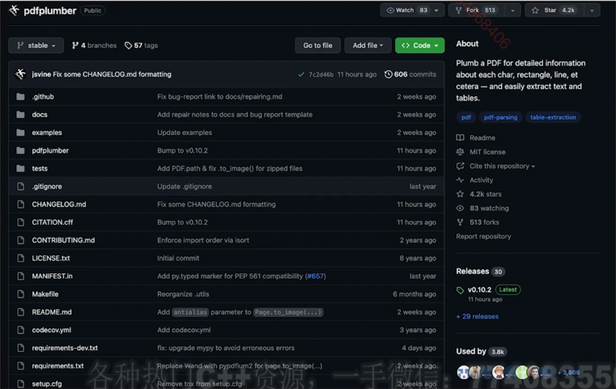

## LLM-Translator 产品规划

### 产品规划（V1.0）

- 支持 PDF 文件格式解析
- 支持英文翻译成中文
- 支持 OpenAI 和 GhatGLM 模型
- 通过 YAML 文件或命令行参数灵活配置
- 模块化和面向对象的设计，易于定制和扩展

### 产品规划（V2.0）

- 支持图形用户界面（GUI），提升易用性
- 支持翻译后能够保留原始 PDF 的布局
- 服务化：以 API 形式提供翻译服务支持
- 添加对其他语言的支持

## LLM-Translator 技术思路与架构设计

### 设计思路

1. PDF 输入文件进行加载和解析
2. PDF 文件解析器（解析为一页一页的文本内容）
3. 文本内容按页翻译（设计不同的 Prompt 使得翻译质量提高）
4. 获得 LLM 翻译的结果
5. LLM 翻译的文本结果导出

### 相关资料
1. PDF 解析库: pdfplumber (Python 开源库)

- 将 PDF 封装为 pdfplumber.PDF 类实例
- pdfplumber.page 记录 PDF 的每一页，即 pdfplumber.Page
- pdfplumber.metadata 记录 PDF 的元数据，如作者、出版时间等
